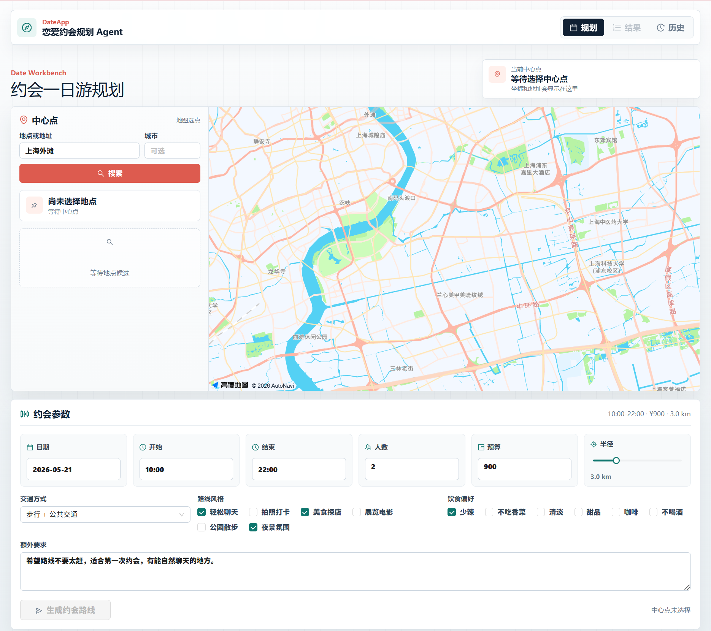
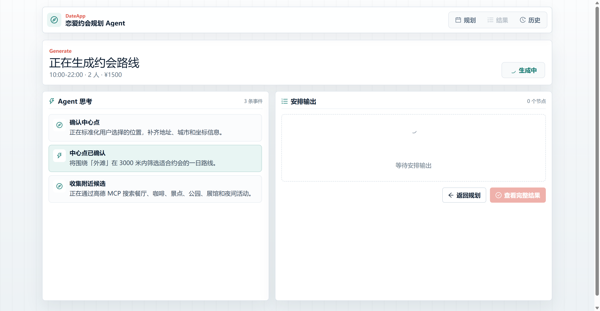
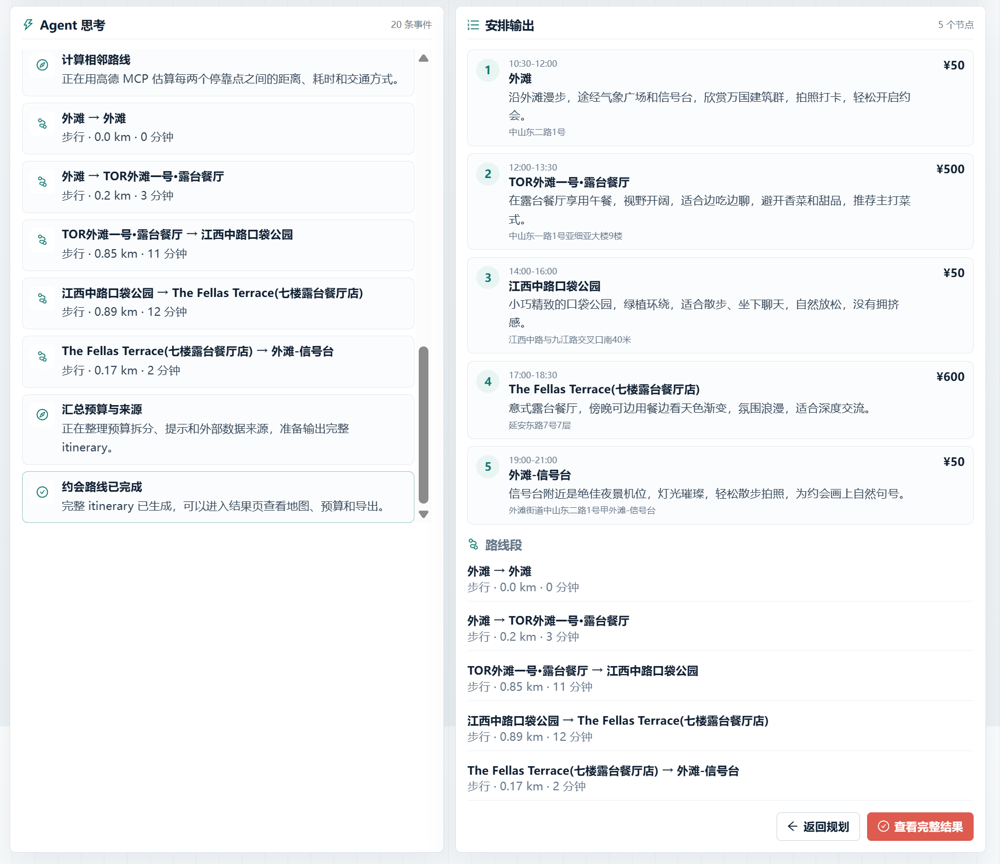
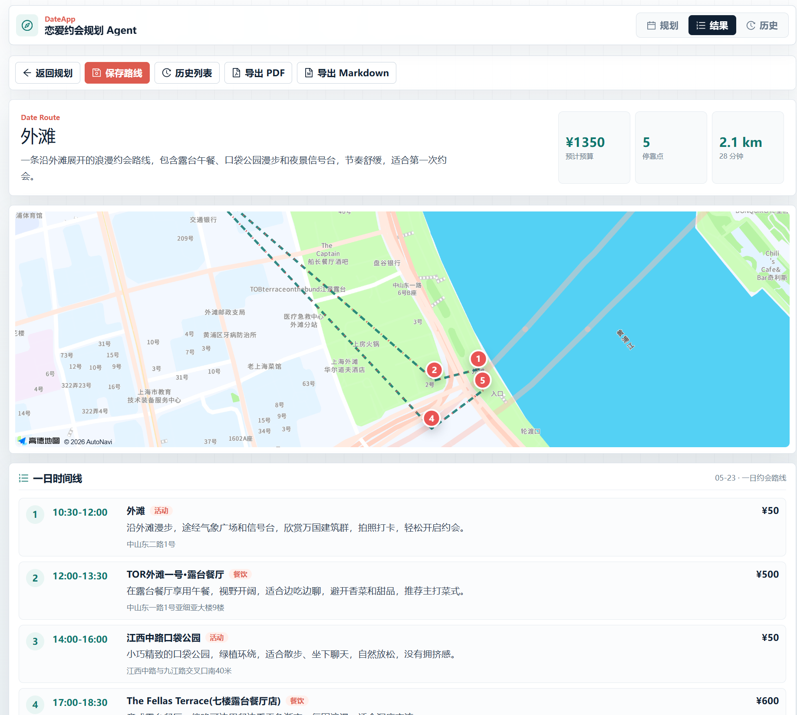
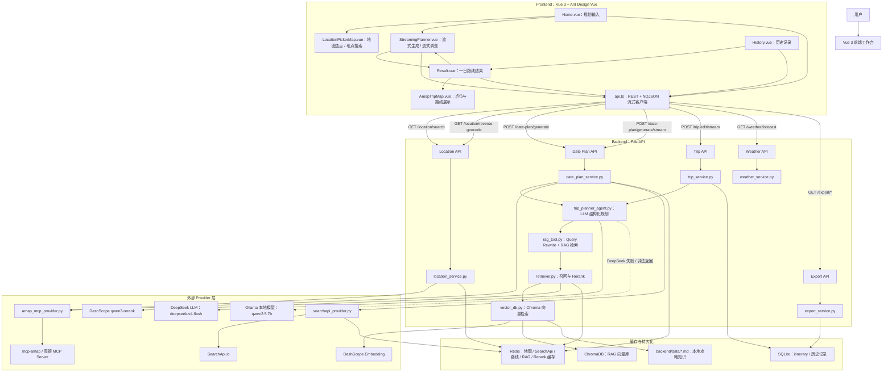
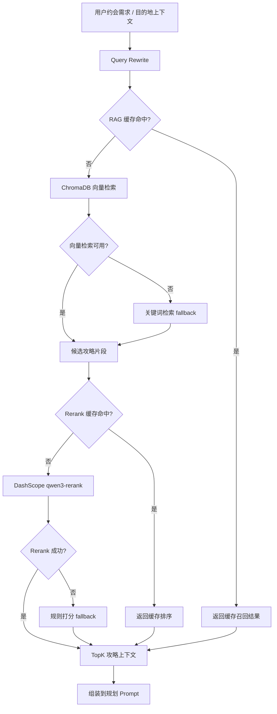
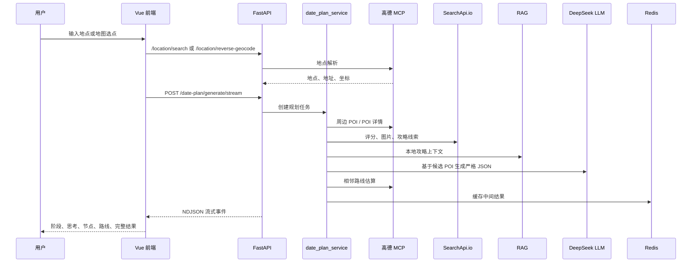

# 💘 DateApp 恋爱约会规划 Agent

> 一个地图选点驱动的约会一日游规划系统：输入地点或在地图上选点，Agent 会结合高德 MCP、SearchApi.io、RAG、本地攻略与大模型，生成可视化、可调整、可保存、可导出的约会路线。

DateApp 是一个面向恋爱约会场景的 AI 规划项目。用户可以输入地点、地址，或直接在地图上点击选择约会中心点；系统会解析位置、搜索周边 POI、补充外部评价与攻略线索，再生成一天的约会安排，包括去哪玩、哪里吃饭、休息点、夜间轻活动、预算、路线距离和交通耗时。

相比只输出一段文本的 LLM Demo，这个项目更强调完整产品链路：从 **地图选点、地点解析、候选 POI 收集、RAG 知识增强、Agent 流式规划、路线估算、结果地图展示，到历史管理与文档导出**，都围绕真实可用的一日约会体验组织。

## 📝 当前版本能力

- `2026-05-21`
  - LLM 兜底：为 DeepSeek 主链路新增 Ollama 本地模型 fallback，DeepSeek 连接失败、调用异常、返回空内容或结构化 JSON 解析失败时会自动尝试本地模型。
  - 覆盖范围：约会一日游生成、旧版行程生成、智能调整和 RAG Query Rewrite 均接入同一套 fallback 机制。
  - Docker 配置：新增 `OLLAMA_FALLBACK_*` 环境变量，Docker 默认通过 `http://host.docker.internal:11434/v1` 访问宿主机 Ollama。
  - 文档更新：补充 Ollama 配置说明、常见问题和架构图中的 DeepSeek → Ollama 兜底链路。
  - 验证结果：后端全量测试 `47 passed, 4 warnings`。
- `2026-05-20`
  - 产品主流程：完成地图选点驱动的约会一日游规划工作台。
  - 地图能力：支持地点搜索、候选选择、地图点击选点、反向地理编码和结果页点位展示。
  - Agent 能力：新增一日约会规划编排，围绕中心点收集餐饮、咖啡/甜品、景点、公园、展馆/影院、商圈和夜间活动候选。
  - 流式体验：生成约会路线和智能调整路线均支持 POST + NDJSON 流式输出，前端逐步展示阶段、思考、安排节点和路线段。
  - Provider 隔离：DeepSeek LLM、DashScope Embedding、DashScope Rerank、高德 MCP、SearchApi.io 均集中在后端配置。
  - Docker 部署：提供 `frontend`、`backend`、`redis` 三服务编排，后端镜像内置 Node 20 与 `mcp-amap`。
  - 验证结果：后端 `45 passed, 4 warnings`，前端 `npm run build` 通过，Docker 下前端、后端、Redis 可正常启动。

更多设计说明见：[PROJECT_DESIGN_NOTES.md](./PROJECT_DESIGN_NOTES.md)

---

## 📸 效果展示

> 当前目录保留了项目展示图，后续如果 UI 继续迭代，只需要替换 `assets/showcase/` 下的图片即可。

### 规划工作台



### 路线生成页




### 生成结果




---

## ✨ 项目亮点

- 🗺️ **地图选点优先**：支持输入地点、地址搜索，也支持地图点击选点，并展示解析后的地点、地址和坐标。
- 🧠 **约会一日游 Agent**：基于中心点、时间段、预算、人数、偏好、饮食限制和交通方式生成 4-6 个停靠点的一日路线。
- 🌊 **流式规划体验**：生成和调整都进入独立流式页面，逐步展示 Agent 阶段、判断、安排节点、路线段和最终结果。
- 📍 **高德 MCP 集成**：通过 `@amap/amap-maps-mcp-server` 调用地理编码、反向地理编码、文本搜索、周边搜索、POI 详情和路线估算。
- 🔎 **SearchApi.io 增强**：优先使用 Google Maps 结果补充评分、评论数量、图片和营业信息，必要时用 Google Search 补充攻略线索。
- 📚 **RAG 攻略增强**：本地 Markdown 攻略 + ChromaDB + DashScope Embedding + qwen3-rerank，为规划提供稳定上下文。
- ⚡ **Redis 缓存层**：缓存天气、地图、SearchApi、路线估算、RAG 检索和 Rerank 结果，减少重复调用。
- 🧩 **Provider 隔离与本地兜底**：LLM、Embedding、Rerank、高德、SearchApi 都由后端环境变量管理；DeepSeek 不可用时可自动切到本地 Ollama。
- 🗂️ **历史管理**：支持保存、查看、打开、删除已生成 itinerary。
- 📄 **文档导出**：支持 Markdown 和中文 PDF 导出。
- 🐳 **Docker 一键启动**：Compose 编排前端、后端、Redis，后端镜像内置 MCP 运行环境。

---

## 🏗️ 技术架构

### 技术栈

| 模块 | 技术 |
| :--- | :--- |
| 前端 | Vue 3 + Vite + TypeScript + Ant Design Vue |
| 后端 | FastAPI + Pydantic + SQLAlchemy |
| LLM | DeepSeek OpenAI-compatible API，当前模型 `deepseek-v4-flash`；失败时 fallback 到 Ollama |
| Embedding | DashScope Embedding，默认 `text-embedding-v4` |
| Rerank | DashScope `qwen3-rerank` |
| RAG 向量库 | ChromaDB |
| 缓存 | Redis |
| 持久化 | SQLite |
| 地图服务 | 高德 MCP Server + 高德 JavaScript API |
| 搜索增强 | SearchApi.io |
| 流式协议 | POST + NDJSON |
| 部署 | Docker Compose |

### 核心架构分层

| 层级 | 关键文件 | 职责 |
| :--- | :--- | :--- |
| 前端视图层 | `frontend/src/views/` | 规划页、流式执行页、结果页、历史页 |
| 前端组件层 | `frontend/src/components/` | 地图选点、结果地图、路线 marker 展示 |
| 前端 API 层 | `frontend/src/services/api.ts` | REST 请求、NDJSON 流式读取 |
| 接口层 | `backend/app/api/routes/` | location、date-plan、trip、weather、export 路由 |
| 服务层 | `backend/app/services/` | 约会规划、地点解析、保存、导出、天气、缓存 |
| Provider 层 | `backend/app/services/providers/` | 高德 MCP、SearchApi.io 外部依赖封装 |
| Agent 层 | `backend/app/agents/` | LLM 结构化规划、RAG 工具调用 |
| RAG 层 | `backend/app/rag/` | 文档切分、向量检索、Rerank、检索 fallback |
| 数据层 | `backend/data/`、`backend/db/` | 本地攻略、SQLite、ChromaDB |

### 系统数据流



数据流路径：前端完成地点选择和约会偏好输入 → 后端标准化中心点 → 高德 MCP 收集周边 POI → SearchApi.io 补充可信度信息 → RAG 提供本地攻略上下文 → DeepSeek 生成结构化 itinerary，失败时切到 Ollama → 高德 MCP 估算相邻路线 → 前端流式展示并进入结果页。

### 数据存储与缓存分工

- **SQLite：保存用户需要留下来的数据**
  - 保存 itinerary、标题、目的地、日期、预算、详情 JSON 和创建时间。
  - 用于历史列表、历史详情、打开历史路线、导出 Markdown/PDF。

- **Redis：缓存短期可复用的中间结果**
  - 缓存天气、地图地理编码、周边 POI、SearchApi 查询、路线估算、RAG 检索和 Rerank 结果。
  - 通过 `cache_service.py` 统一读写，Redis 不可用时允许业务降级运行。

- **ChromaDB：保存 RAG 向量索引**
  - 将 `backend/data/*.md` 的攻略片段转为向量，供规划阶段召回。
  - 默认 collection 为 `travel_guides`。

- **Markdown：保存可维护攻略知识**
  - 适合持续补充城市玩法、约会路线、餐饮建议和风格化描述。

---

## 🧠 RAG 检索流程



RAG 层由三部分组成：

- `backend/app/rag/vector_db.py`：Markdown 切分、Embedding、Chroma 入库和向量召回。
- `backend/app/rag/retriever.py`：召回候选、DashScope Rerank、规则 fallback 和 Redis 缓存。
- `backend/app/agents/tools/rag_tool.py`：面向 Agent 的 RAG 工具，负责 Query Rewrite 和上下文整理。

---

## 📁 项目结构

```text
DateApp/
├── README.md
├── PROJECT_DESIGN_NOTES.md
├── CHANGELOG.md
├── docker-compose.yml
├── .env.docker.example
├── assets/
│   └── showcase/
├── backend/
│   ├── Dockerfile
│   ├── requirements.txt
│   ├── .env.example
│   ├── app/
│   │   ├── api/
│   │   │   ├── main.py
│   │   │   └── routes/
│   │   │       ├── date_plan.py
│   │   │       ├── export.py
│   │   │       ├── location.py
│   │   │       ├── trip.py
│   │   │       └── weather.py
│   │   ├── agents/
│   │   │   ├── trip_planner_agent.py
│   │   │   └── tools/
│   │   │       └── rag_tool.py
│   │   ├── models/
│   │   │   ├── db_models.py
│   │   │   └── schemas.py
│   │   ├── rag/
│   │   │   ├── retriever.py
│   │   │   └── vector_db.py
│   │   └── services/
│   │       ├── cache_service.py
│   │       ├── date_plan_service.py
│   │       ├── export_service.py
│   │       ├── location_service.py
│   │       ├── map_service.py
│   │       ├── storage_service.py
│   │       ├── trip_service.py
│   │       ├── weather_service.py
│   │       └── providers/
│   │           ├── amap_mcp_provider.py
│   │           └── searchapi_provider.py
│   ├── data/
│   ├── db/
│   ├── eval/
│   ├── scripts/
│   └── tests/
└── frontend/
    ├── Dockerfile
    ├── package.json
    ├── .env.example
    └── src/
        ├── App.vue
        ├── components/
        │   ├── AmapTripMap.vue
        │   └── LocationPickerMap.vue
        ├── services/
        │   └── api.ts
        ├── types/
        │   └── index.ts
        └── views/
            ├── History.vue
            ├── Home.vue
            ├── Result.vue
            └── StreamingPlanner.vue
```

### 关键文件职责

- `backend/app/services/date_plan_service.py`  
  约会一日游核心编排：中心点标准化、候选 POI 收集、SearchApi 补充、LLM 规划、规则 fallback、路线估算和预算汇总。

- `backend/app/services/providers/amap_mcp_provider.py`  
  通过 Python `mcp` SDK 调用 `mcp-amap`，统一封装高德地图工具能力。

- `backend/app/services/providers/searchapi_provider.py`  
  调用 SearchApi.io 的 Google Maps / Google Search 能力，补充 POI 评分、评论、图片、链接和攻略来源。

- `backend/app/agents/trip_planner_agent.py`  
  调用 DeepSeek LLM 生成结构化 itinerary，并处理 JSON 解析、token 统计和基础容错。

- `backend/app/agents/tools/rag_tool.py`  
  RAG 在线工具，负责 Query Rewrite、检索调用和上下文格式化。

- `frontend/src/views/StreamingPlanner.vue`  
  流式执行页，用于展示生成和调整过程中的阶段、思考、安排节点、路线段和最终结果。

- `frontend/src/components/LocationPickerMap.vue`  
  地图选点组件，支持地点搜索、候选列表、地图点击和反向地理编码。

---

## 🚀 快速启动

### 0. Docker 一键启动（推荐）

项目已提供 Docker 编排，包含：

- `frontend`：Vue 前端，容器内使用 Nginx 提供静态页面，映射到 `http://localhost:5173`
- `backend`：FastAPI 后端，映射到 `http://localhost:8000`
- `redis`：缓存服务，映射到 `localhost:6379`

```powershell
cd path\to\DateApp

# 复制 Docker 环境变量模板
Copy-Item .env.docker.example .env

# 编辑 .env，填写 DeepSeek、DashScope、高德、SearchApi 和前端高德 JS 配置

# 构建并启动
docker compose up --build -d

# 查看服务状态
docker compose ps
```

启动后访问：

- 前端页面：http://localhost:5173
- 后端健康检查：http://localhost:8000/health
- 后端接口文档：http://localhost:8000/docs

常用 Docker 命令：

```powershell
# 查看后端日志
docker compose logs -f backend

# 查看前端日志
docker compose logs -f frontend

# 重新构建前端，适用于修改 VITE_* 环境变量后
docker compose up --build -d frontend

# 停止服务
docker compose down

# 连同 SQLite、ChromaDB 和 Redis 数据一起清空
docker compose down -v
```

如果需要初始化或重建 RAG 向量库：

```powershell
docker compose exec backend python scripts/ingest_data.py
```

### 1. 本地启动后端

本地启动高德 MCP Provider 需要先安装 Node.js，并全局安装 `mcp-amap`：

```powershell
npm install -g @amap/amap-maps-mcp-server@0.0.8
```

启动 Redis（可选，但推荐）：

```powershell
docker run --name dateapp-redis -p 6379:6379 -d redis:7-alpine
```

启动后端：

```powershell
cd path\to\DateApp\backend

python -m venv .venv
.\.venv\Scripts\Activate.ps1
python -m pip install --upgrade pip
pip install -r requirements.txt

Copy-Item .env.example .env
# 编辑 .env，填写必要配置

uvicorn app.api.main:app --reload --host 0.0.0.0 --port 8000
```

如果本地需要启用完整 SearchApi 与高德 MCP 能力，确保 `.env` 中补充：

```env
AMAP_PROVIDER=mcp
MCP_AMAP_COMMAND=mcp-amap
SEARCHAPI_API_KEY=your_searchapi_key
SEARCHAPI_BASE_URL=https://www.searchapi.io/api/v1/search
SEARCHAPI_TIMEOUT_SECONDS=20
REDIS_ENABLED=true
REDIS_URL=redis://127.0.0.1:6379/0
```

### 2. 本地启动前端

```powershell
cd path\to\DateApp\frontend

npm install
Copy-Item .env.example .env
# 编辑 .env，填写 VITE_API_BASE_URL、VITE_AMAP_JS_KEY、VITE_AMAP_SECURITY_JS_CODE

npm run dev
```

本地访问：

- 前端：http://localhost:5173
- 后端：http://localhost:8000

---

## 🔐 环境变量

### Docker 根目录 `.env`

推荐从根目录 `.env.docker.example` 复制：

```powershell
Copy-Item .env.docker.example .env
```

核心配置如下：

```env
# DeepSeek LLM
PLANNER_LLM_PROVIDER=openai_compatible
PLANNER_LLM_API_KEY=your_deepseek_api_key
PLANNER_LLM_MODEL=deepseek-v4-flash
PLANNER_LLM_BASE_URL=https://api.deepseek.com

# Query Rewrite LLM
QUERY_REWRITE_LLM_PROVIDER=openai_compatible
QUERY_REWRITE_LLM_API_KEY=your_deepseek_api_key
QUERY_REWRITE_LLM_MODEL=deepseek-v4-flash
QUERY_REWRITE_LLM_BASE_URL=https://api.deepseek.com

# Ollama fallback
OLLAMA_FALLBACK_ENABLED=true
OLLAMA_FALLBACK_MODEL=qwen2.5:7b
OLLAMA_FALLBACK_BASE_URL=http://host.docker.internal:11434/v1
OLLAMA_FALLBACK_API_KEY=ollama
OLLAMA_FALLBACK_TIMEOUT_SECONDS=20
OLLAMA_FALLBACK_MAX_RETRIES=0

# DashScope Embedding / Rerank
EMBEDDING_PROVIDER=dashscope
EMBEDDING_API_KEY=your_dashscope_api_key
EMBEDDING_BASE_URL=https://dashscope.aliyuncs.com/compatible-mode/v1
EMBEDDING_MODEL=text-embedding-v4
RERANK_PROVIDER=dashscope
RERANK_API_KEY=your_dashscope_api_key
RERANK_BASE_URL=https://dashscope.aliyuncs.com/compatible-api/v1
RERANK_MODEL=qwen3-rerank

# 高德 MCP / Web 服务
AMAP_API_KEY=your_amap_web_service_key
AMAP_PROVIDER=mcp
MCP_AMAP_COMMAND=mcp-amap
ENABLE_AMAP_ENRICHMENT=true

# SearchApi.io
SEARCHAPI_API_KEY=your_searchapi_key
SEARCHAPI_BASE_URL=https://www.searchapi.io/api/v1/search
SEARCHAPI_TIMEOUT_SECONDS=20

# Redis
REDIS_KEY_PREFIX=trip_planner
REDIS_DEFAULT_TTL_SECONDS=1800
REDIS_WEATHER_TTL_SECONDS=1800
REDIS_MAP_TTL_SECONDS=86400
REDIS_RAG_TTL_SECONDS=21600
REDIS_RERANK_TTL_SECONDS=21600

# Frontend
VITE_API_BASE_URL=http://localhost:8000
VITE_AMAP_JS_KEY=your_amap_js_api_key
VITE_AMAP_SECURITY_JS_CODE=your_amap_js_security_code
```

### 配置说明

- `PLANNER_LLM_API_KEY`：DeepSeek API Key，用于约会路线规划。
- `QUERY_REWRITE_LLM_API_KEY`：Query Rewrite 使用的 LLM Key，通常可与 `PLANNER_LLM_API_KEY` 相同。
- `OLLAMA_FALLBACK_*`：DeepSeek 连接失败、调用异常、返回空内容或结构化 JSON 解析失败时的本地模型兜底配置。Docker 中默认使用 `http://host.docker.internal:11434/v1` 访问宿主机 Ollama。
- `EMBEDDING_API_KEY`：DashScope API Key，用于 RAG 向量化。
- `RERANK_API_KEY`：DashScope API Key，用于 `qwen3-rerank`。
- `AMAP_API_KEY`：高德 Web 服务 Key，后端 MCP 与地图服务使用。
- `VITE_AMAP_JS_KEY`：高德 JavaScript API Key，前端浏览器地图使用。
- `VITE_AMAP_SECURITY_JS_CODE`：高德 JS API 安全密钥。
- `SEARCHAPI_API_KEY`：SearchApi.io Key，用于 Google Maps / Google Search 数据补充。
- `REDIS_*`：缓存配置，Docker 下 `REDIS_ENABLED` 和 `REDIS_URL` 已由 Compose 注入。

> 不要把真实 API Key 提交到 Git。仓库只保留 `.env.example` 和 `.env.docker.example` 模板。

---

## 📡 核心接口

| 方法 | 路径 | 说明 |
| :--- | :--- | :--- |
| `GET` | `/health` | 后端健康检查 |
| `GET` | `/location/search` | 按关键词和城市搜索地点候选 |
| `GET` | `/location/reverse-geocode` | 按经纬度反查地址与行政区 |
| `POST` | `/date-plan/generate` | 同步生成约会一日游 itinerary |
| `POST` | `/date-plan/generate/stream` | 流式生成约会一日游，返回 NDJSON |
| `POST` | `/trip/edit` | 同步智能调整 itinerary |
| `POST` | `/trip/edit/stream` | 流式智能调整 itinerary |
| `POST` | `/trip/save` | 保存 itinerary |
| `GET` | `/trip` | 获取历史列表 |
| `GET` | `/trip/{trip_id}` | 获取历史详情 |
| `DELETE` | `/trip/{trip_id}` | 删除历史记录 |
| `GET` | `/trip/stats` | 获取 token 消耗统计 |
| `GET` | `/weather/forecast` | 查询天气预报 |
| `GET` | `/export/{trip_id}/markdown` | 导出 Markdown |
| `GET` | `/export/{trip_id}/pdf` | 导出 PDF |

### 流式事件协议

`/date-plan/generate/stream` 和 `/trip/edit/stream` 使用 POST + NDJSON，每一行都是一个 JSON 事件：

```text
stage      当前执行阶段
thought    Agent 的阶段性判断
plan_item  逐步产出的活动或餐饮节点
route      相邻停靠点交通路线
complete   最终 itinerary
error      明确失败原因
```

前端通过 `fetch` + `ReadableStream` + `TextDecoder` 逐行解析，实现在页面上一步一步展示规划过程。

---

## 🔄 关键业务链路

### 约会路线生成



### 智能调整

```text
用户在结果页输入调整需求
  -> 前端进入 StreamingPlanner.vue
  -> POST /trip/edit/stream
  -> 后端基于当前 itinerary 和用户指令调整路线
  -> 流式输出调整阶段、变更节点和最终 itinerary
  -> 用户返回结果页继续保存或导出
```

---

## 🧪 测试与验证

### 后端测试

```powershell
cd path\to\DateApp\backend

python -m pytest tests -q
```

最近一次结果：

```text
45 passed, 4 warnings
```

### 前端构建

```powershell
cd path\to\DateApp\frontend

npm run build
```

最近一次结果：

```text
构建通过，仅有 Vite chunk size warning
```

### Docker 验证

```powershell
cd path\to\DateApp

docker compose up --build -d frontend
docker compose ps
```

最近一次结果：

```text
backend healthy / frontend running / redis healthy
```

### 浏览器验收场景

- 输入“上海外滩”可以返回地点候选。
- 选择候选后地图 marker 正确移动，中心点摘要、地址和坐标正确展示。
- 点击“生成约会路线”会进入流式执行页。
- 生成过程中可以看到阶段、思考、安排节点和路线段逐步出现。
- 生成完成后可以进入完整结果页，地图、时间线、预算、交通、天气和来源展示正常。
- 结果页点击“调整路线”会进入同一套流式执行页。
- 调整完成后可返回结果页保存或导出。

---

## 🛠️ 常见问题

### 前端地图不显示

检查：

- `VITE_AMAP_JS_KEY` 是否填写的是高德 JavaScript API Key。
- `VITE_AMAP_SECURITY_JS_CODE` 是否填写。
- 高德控制台里 Web 端 JS API 的域名白名单是否包含当前访问域名。
- 修改 `VITE_*` 后是否重新构建前端镜像。

### 生成失败或一直卡在流式页面

检查：

- `PLANNER_LLM_API_KEY` 是否可用。
- `PLANNER_LLM_BASE_URL` 是否正确。
- 如果 DeepSeek 临时不可用，确认本机是否已启动 Ollama，并已执行 `ollama pull qwen2.5:7b`。
- Docker 部署时确认 `OLLAMA_FALLBACK_BASE_URL` 是否能从后端容器访问宿主机 Ollama。
- 后端日志中是否有 DeepSeek、DashScope、高德 MCP 或 SearchApi 的错误。
- Docker 下 `backend` 是否为 healthy。

```powershell
docker compose logs -f backend
```

### 高德 MCP 不可用

检查：

- Docker 构建是否成功安装 `@amap/amap-maps-mcp-server@0.0.8`。
- 本地运行时是否执行过 `npm install -g @amap/amap-maps-mcp-server@0.0.8`。
- `AMAP_PROVIDER=mcp` 和 `MCP_AMAP_COMMAND=mcp-amap` 是否配置。
- `AMAP_API_KEY` 是否为有效高德 Web 服务 Key。

### Ollama fallback 不生效

检查：

- 本机是否安装并启动 Ollama。
- 是否已拉取模型：

```powershell
ollama pull qwen2.5:7b
```

- 本地后端运行时 `OLLAMA_FALLBACK_BASE_URL` 是否为 `http://127.0.0.1:11434/v1`。
- Docker 后端运行时 `OLLAMA_FALLBACK_BASE_URL` 是否为 `http://host.docker.internal:11434/v1`。
- `OLLAMA_FALLBACK_ENABLED` 是否为 `true`。

### SearchApi.io 不可用

SearchApi 主要用于补充评分、图片、评论和攻略线索。它失败时系统会降级为高德 MCP-only，但结果可信度信息会减少。

检查：

- `SEARCHAPI_API_KEY` 是否填写。
- `SEARCHAPI_BASE_URL` 是否为 `https://www.searchapi.io/api/v1/search`。
- 后端日志是否出现超时、余额不足或请求失败。

### Redis 是否已经配置好

Docker 模式下 Redis 已经在 `docker-compose.yml` 中配置，后端使用：

```text
REDIS_ENABLED=true
REDIS_URL=redis://redis:6379/0
```

可以通过下面命令确认：

```powershell
docker compose ps
docker compose logs redis
```

本地模式下需要手动启动 Redis，并在 `backend/.env` 中设置：

```env
REDIS_ENABLED=true
REDIS_URL=redis://127.0.0.1:6379/0
```

### RAG 没有召回内容

检查：

- `EMBEDDING_API_KEY` 是否填写。
- `CHROMA_DB_DIR` 是否可写。
- 是否执行过 `python scripts/ingest_data.py`。
- `backend/data/*.md` 是否存在攻略文档。

### `npm run build` 出现 chunk size warning

这是 Vite 对构建产物大小的提醒。当前构建可通过，不影响运行。后续可以按页面拆分、动态导入地图组件或调整 `manualChunks` 继续优化。

---

## ✅ 当前完成度

- ✅ 地图选点、地点搜索、反向地理编码。
- ✅ 约会一日游 Agent 编排。
- ✅ 高德 MCP Provider。
- ✅ SearchApi.io Provider。
- ✅ DeepSeek `deepseek-v4-flash` 规划模型配置。
- ✅ Ollama 本地模型 fallback。
- ✅ DashScope Embedding + DashScope `qwen3-rerank`。
- ✅ RAG 本地攻略增强、向量检索、Rerank 和 fallback。
- ✅ Redis 缓存层。
- ✅ 流式生成和流式调整。
- ✅ 结果页地图、时间线、预算、交通、天气和来源展示。
- ✅ 历史保存、详情、删除、Markdown/PDF 导出。
- ✅ Docker Compose 部署。
- ✅ 后端测试和前端构建验证通过。

## 🌱 后续优化方向

- **更多城市与约会场景知识库**  
  扩充本地 Markdown 攻略，覆盖展馆、夜景、散步、轻户外、纪念日、雨天方案等场景。

- **更强的 POI 可信度排序**  
  结合评分、评论数量、距离、营业时间、预算、人群拥挤程度和约会氛围做综合排序。

- **结果页二次编辑能力**  
  支持拖拽调整节点顺序、替换单个地点、锁定某个餐厅后重新生成其余路线。

- **成本与延迟观测面板**  
  在前端展示 LLM、RAG、Rerank、SearchApi 和地图调用耗时与 token 消耗。

- **更完整的路线交通方式**  
  按步行、公交、驾车和混合模式生成更细的路线段说明。

- **账户与会话管理**  
  支持多用户保存约会方案、收藏地点和历史偏好。
