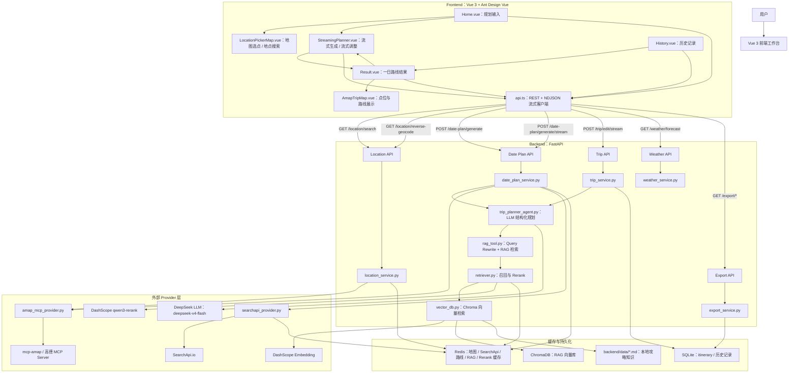

# DateApp 项目架构图

```mermaid
flowchart TB
  U["用户"] --> FE["Vue 3 前端工作台"]

  subgraph Frontend["Frontend：Vue 3 + Ant Design Vue"]
    Home["Home.vue：规划输入"]
    Picker["LocationPickerMap.vue：地图选点 / 地点搜索"]
    Stream["StreamingPlanner.vue：流式生成 / 流式调整"]
    Result["Result.vue：一日路线结果"]
    MapView["AmapTripMap.vue：点位与路线展示"]
    History["History.vue：历史记录"]
    ApiClient["api.ts：REST + NDJSON 流式客户端"]

    Home --> Picker
    Home --> Stream
    Stream --> Result
    Result --> MapView
    Result --> Stream
    History --> Result
    Home --> ApiClient
    Stream --> ApiClient
    Result --> ApiClient
    History --> ApiClient
  end

  ApiClient -->|"GET /location/search"| LocationAPI["Location API"]
  ApiClient -->|"GET /location/reverse-geocode"| LocationAPI
  ApiClient -->|"POST /date-plan/generate"| DatePlanAPI["Date Plan API"]
  ApiClient -->|"POST /date-plan/generate/stream"| DatePlanAPI
  ApiClient -->|"POST /trip/edit/stream"| TripAPI["Trip API"]
  ApiClient -->|"GET /weather/forecast"| WeatherAPI["Weather API"]
  ApiClient -->|"GET /export/*"| ExportAPI["Export API"]

  subgraph Backend["Backend：FastAPI"]
    LocationAPI --> LocationService["location_service.py"]
    DatePlanAPI --> DatePlanService["date_plan_service.py"]
    TripAPI --> TripService["trip_service.py"]
    WeatherAPI --> WeatherService["weather_service.py"]
    ExportAPI --> ExportService["export_service.py"]

    DatePlanService --> PlannerAgent["trip_planner_agent.py：LLM 结构化规划"]
    TripService --> PlannerAgent

    PlannerAgent --> RagTool["rag_tool.py：Query Rewrite + RAG 检索"]
    RagTool --> Retriever["retriever.py：召回与 Rerank"]
    Retriever --> VectorDB["vector_db.py：Chroma 向量检索"]
  end

  subgraph Providers["外部 Provider 层"]
    AmapProvider["amap_mcp_provider.py"]
    SearchProvider["searchapi_provider.py"]
    DeepSeek["DeepSeek LLM：deepseek-v4-flash"]
    DashEmb["DashScope Embedding"]
    DashRerank["DashScope qwen3-rerank"]
    AmapMCP["mcp-amap / 高德 MCP Server"]
    SearchAPI["SearchApi.io"]
  end

  LocationService --> AmapProvider
  DatePlanService --> AmapProvider
  DatePlanService --> SearchProvider
  PlannerAgent --> DeepSeek
  VectorDB --> DashEmb
  Retriever --> DashRerank
  AmapProvider --> AmapMCP
  SearchProvider --> SearchAPI

  subgraph Storage["缓存与持久化"]
    Redis["Redis：地图 / SearchApi / 路线 / RAG / Rerank 缓存"]
    SQLite["SQLite：itinerary / 历史记录"]
    Chroma["ChromaDB：RAG 向量库"]
    Markdown["backend/data/*.md：本地攻略知识"]
  end

  LocationService --> Redis
  DatePlanService --> Redis
  SearchProvider --> Redis
  Retriever --> Redis
  TripService --> SQLite
  ExportService --> SQLite
  VectorDB --> Chroma
  VectorDB --> Markdown
```
